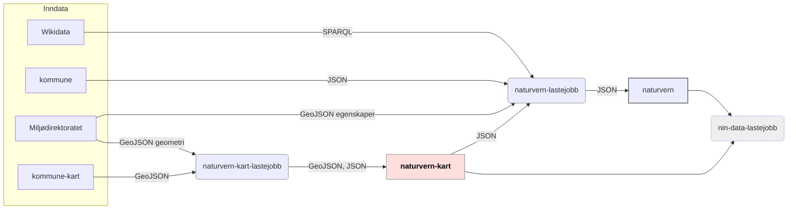

```mermaid

graph LR;
  linkStyle default interpolate monotoneX
    subgraph Inndata
      kommune[kommune]
      kommune-kart[kommune-kart]
      wikidata[Wikidata]
      mdir[Miljødirektoratet]
    end
      naturvern-kart-lastejobb(naturvern-kart-lastejobb)
      naturvern-lastejobb(naturvern-lastejobb)
    naturvern-kart[naturvern-kart]
    naturvern[naturvern]
    wikidata-->|SPARQL|naturvern-lastejobb;
    kommune-->|JSON|naturvern-lastejobb;
    mdir-->|GeoJSON egenskaper|naturvern-lastejobb;
    mdir-->|GeoJSON geometri|naturvern-kart-lastejobb;
    naturvern-kart-lastejobb-->|GeoJSON, JSON|naturvern-kart;
    naturvern-kart-->|JSON|naturvern-lastejobb;
    naturvern-lastejobb-->|JSON|naturvern;
    kommune-kart-->|GeoJSON|naturvern-kart-lastejobb(naturvern-kart-lastejobb);
    naturvern-->nin-data-lastejobb(nin-data-lastejobb);
    naturvern-kart-->nin-data-lastejobb(nin-data-lastejobb);
    click naturvern-lastejobb "https://github.com/Artsdatabanken/naturvern-lastejobb" "_"
    click naturvern "https://github.com/Artsdatabanken/naturvern" "_"
    click naturvern-kart "https://github.com/Artsdatabanken/naturvern-kart" "_"
    click naturvern-kart-lastejobb "https://github.com/Artsdatabanken/naturvern-kart-lastejobb" "_"
    click kommune-kart "https://github.com/Artsdatabanken/kommune-kart" "_"
    click wikidata "https://www.wikidata.org/wiki/Q15284" "_"
    click mdir "https://www.mdir.no" "_"

class naturvern-kart focus
class kommune,wikidata,mdir data
class naturvern,xnaturvern-kart, utdata
class naturvern-lastejobb,naturvern-kart-lastejobb lastejobb
class nin-data-lastejobb next
classDef focusx stroke:#888,stroke-width:3px,font-weight:600;
classDef focus color:#000,fill:#ffdede,stroke:#888,stroke-widthx:3px,font-weight:600;
classDef data fillx:#ffd;
classDef lastejobb fillx:#fff,stroke:#888;
classDef utdata fillx:#ffa,stroke:#000;
classDef next fill:#eee,stroke-dasharray: 2, 2;

```
